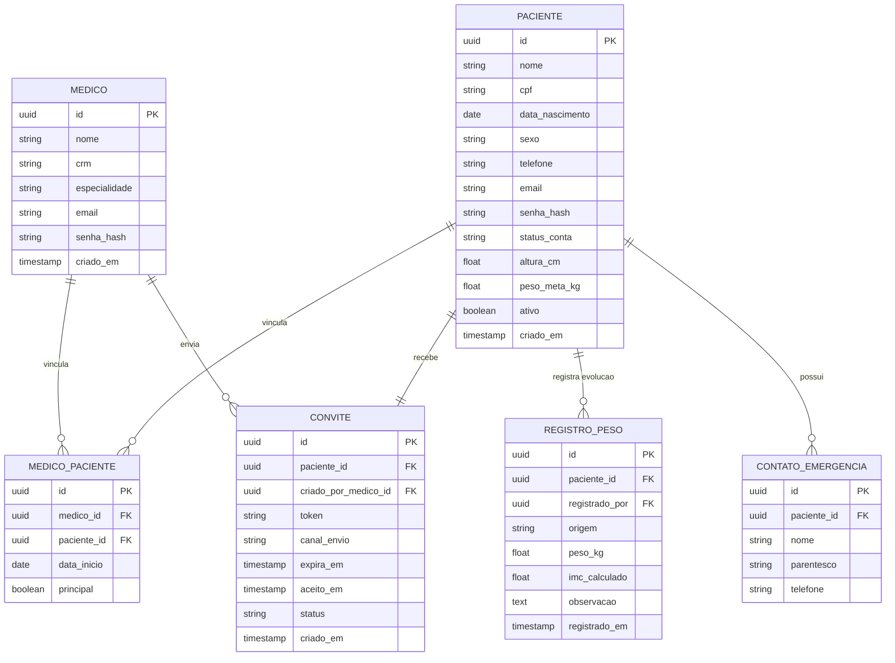

# Modelo de Dados — Health Tracker

## Diagrama ER — MVP Módulo 1

---

## Decisões de modelagem

### Por que `MEDICO_PACIENTE` como tabela de junção?
Hoje o sistema tem apenas uma médica, mas a tabela de junção
prepara o banco para múltiplos médicos sem necessidade de
remodelar o schema no futuro. O campo `principal` resolve o
caso de um paciente ter mais de um médico responsável.

### Por que `CONVITE` é uma tabela separada?
O convite tem ciclo de vida próprio: gerado, enviado, expirado,
aceito. Manter histórico de tentativas de convite é útil para
auditoria e para a médica saber se o paciente nunca ativou a conta.

### Por que `REGISTRO_PESO` e não um campo em `PACIENTE`?
O projeto exige histórico de evolução de peso ao longo do tempo.
Um campo único sobrescreveria o valor anterior. A tabela de
registros permite gráficos de evolução e rastreamento de quem
registrou cada medição (médica em consulta ou paciente em casa).

### Campo `origem` em `REGISTRO_PESO`
Valores possíveis: `consulta` ou `auto_registro`. Preenchido
automaticamente pelo backend a partir do role no JWT — nunca
enviado pelo app.

### Campo `status_conta` em `PACIENTE`
Valores possíveis: `convidado` → `ativo`. Paciente começa como
`convidado` ao ser cadastrado pela médica. Vira `ativo` ao
definir a própria senha pelo link de convite.

### Soft delete em `PACIENTE`
Pacientes não são excluídos fisicamente. O campo `ativo = false`
os inativa, preservando todo o histórico clínico.
